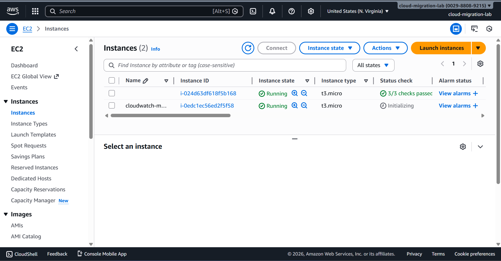
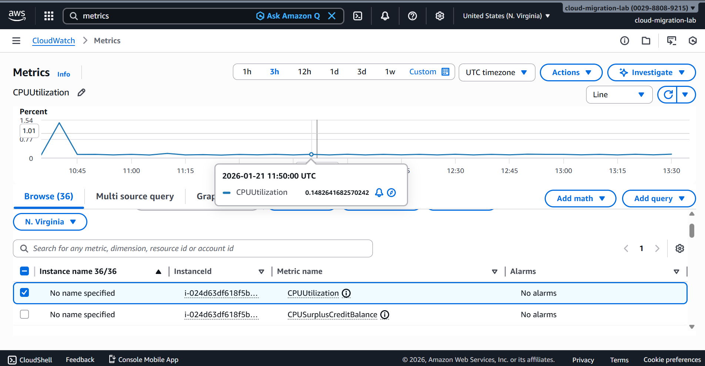
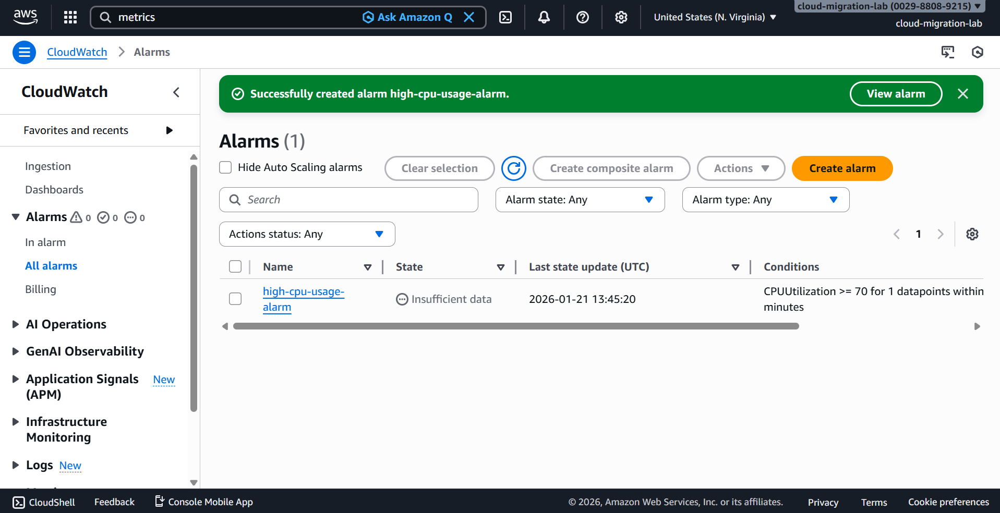

# Cloud Monitoring Project using AWS CloudWatch

## Overview
This project demonstrates how to monitor cloud infrastructure using AWS CloudWatch. An EC2 instance is monitored for performance metrics, and an alarm is configured to detect high CPU usage.

## Problem Statement
Without monitoring, cloud resources may experience performance issues or failures without detection, leading to downtime.

## Solution
AWS CloudWatch is used to monitor EC2 metrics and trigger alarms when CPU usage exceeds a defined threshold.

## Architecture
EC2 Instance → CloudWatch Metrics → CloudWatch Alarm

## Tools & Services Used
- Amazon EC2
- AWS CloudWatch
- AWS Management Console
- GitHub

## Implementation Steps
1. Launched an EC2 instance
2. Viewed EC2 performance metrics in CloudWatch
3. Created a CPU utilization alarm
4. Verified monitoring configuration

## Screenshots

### EC2 Instance Running

### CPU Utilization Metric

### CloudWatch Alarm

## Outcome
The project successfully monitors EC2 performance and detects abnormal CPU usage using AWS CloudWatch.
